theme: jekyll-theme-slate
markdown: CommonMarkGhPages


## Table of contents

- [Table of contents](#table-of-contents)
- [1 Introduction](#1-introduction)
	- [1-1 Overview](#1-1-overview)
	- [1-2 Learning goals](#1-2-learning-goals)
	- [1-3 Requirements for completion](#1-3-requirements-for-completion)
	- [1-4 References and Materials](#1-4-references-and-materials)
- [2 The biological context](#2-the-biological-context)
	- [2-1 The eye lens, crystallins and cataracts](#2-1-the-eye-lens-crystallins-and-cataracts)
	- [2-2 Learning more about the _CRYBA4_ gene and its variants](#2-2-learning-more-about-the-cryba4-gene-and-its-variants)
- [3  Identifying deleterious SNPs in the CRYBA4 gene using SnpEff](#3-identifying-deleterious-snps-in-the-cryba4-gene-using-snpeff)
- [4 Visualizing the gene and its annotated variants using the UCSC Genome Browser](#4-visualizing-the-gene-and-its-annotated-variants-using-the-ucsc-genome-browser)
	- [4-1 Overview of the UCSC Genome Browser](#4-1-overview-of-the-ucsc-genome-browser)
		- [_What does the Genome Browser provide?_](#what-does-the-genome-browser-provide)
		- [Reset to the default setting:](#reset-to-the-default-setting)
		- [Select species and assembly](#select-species-and-assembly)
		- [Browser interface](#browser-interface)
		- [Track display modes](#track-display-modes)
		- [Highlighting a region](#highlighting-a-region)
		- [Further Navigation Options](#further-navigation-options)
		- [Save as a png format image](#save-as-a-png-format-image)
	- [4-2 Exploring the CRYBA4 locus in the UCSC Genome Browser](#4-2-exploring-the-cryba4-locus-in-the-ucsc-genome-browser)
	- [4-3 Visualizing the SnpEff-annotated variants as a custom track in the UCSC Genome Browser](#4\--3-visualizing-the-snpeff-annotated-variants-as-a-custom-track-in-the-ucsc-genome-browser)
		- [Custom tracks](#custom-tracks)
		- [BED format](#bed-format)
		- [Generating the BED format files](#generating-the-bed-format-files)
		- [Uploading the BED format files as custom tracks](#uploading-the-bed-format-files-as-custom-tracks)
		- [_Exploring the variants_](#exploring-the-variants)
- [5 Identifying deleterious SNPs in the** _CRYBA4_ gene using the ENSEMBL Variant Effect Predictor (VEP) -](#5-identifying-deleterious-snps-in-the-cryba4-gene-using-the-ensembl-variant-effect-predictor-vep-)
	- [5-1 Overview of the ENSEMBL VEP](#5-1-overview-of-the-ensembl-vep)
		- [_What does VEP provide?_](#what-does-vep-provide)
	- [5-2 Using VEP to annotate the SnpEff modifiers annotated as having HIGH impact](#5-2-using-vep-to-annotate-the-snpeff-modifiers-annotated-as-having-high-impact)
		- [_Exploring and navigating the VEP results page_](#exploring-and-navigating-the-vep-results-page)
		- [Downloading the results](#downloading-the-results)
	- [5-3 Exploring the agreement between the annotation obtained with different tools](#5-3-exploring-the-agreement-between-the-annotation-obtained-with-different-tools)
	- [5-4 Exploring the annotation of the novel variants](#5-4-exploring-the-annotation-of-the-novel-variants)


## 1 Introduction

### 1-1 Overview

In this practical you will learn how to use well-established methods and resources to annotate a collection of variants to determine if a given substitution has a deleterious effect and possibly pathological consequences.

We will follow the example in the paper by [Wang et al., PLoS One, 2020, 15(1)]( https://journals.plos.org/plosone/article/file?id=10.1371/journal.pone.0227859&amp;type=printable) presented in the lecture and focus on the variation associated with the gene [_CRYBA4_ ](https://www.genecards.org/cgi-bin/carddisp.pl?gene=CRYBA4&amp;keywords=cryba4) (crystallin beta A4).

You will start with a large collection of SNPs reported for _CRYBA4_ in the [dbSNP database](https://www.ncbi.nlm.nih.gov/books/NBK21088/) and you will annotate them using the command-line annotation and functional prediction tool [SNPEff](http://pcingola.github.io/SnpEff/se_introduction/). You will visualize some of these variants using the [UCSC Genome Browser](https://genome.ucsc.edu/training/index.html) to understand their position and properties in the context of the genomic region of the _CRYBA4_ gene. As time permits, you will also annotate a subset of these variants using the online tool [ENSEMBLE Variant Effect Predictor (VEP)](https://www.youtube.com/watch?v=6MltwC-ydN0).

### 1-2 Learning goals

The goal of the practical is to familiarize you with annotation tools that you could apply to any set of variants of interest and also, to enhance your knowledge on how to use the UCSC Genome Browser for extracting important information about a variant or a gene region.

### 1-3 Requirements for completion

To complete this practical you need to go through Parts 2-4 of this document and answer the questions. You are strongly encouraged to complete Part 5 as well, but do as much as you can as time permits. Please, submit your report to voichita.marinescu@imbim.uu.se **no later than May 27, 2022.**

### 1-4 References and Materials

- The paper discussed in the lecture: [Wang et al., PLoS One, 2020, 15(1)](./wang_etal_2020.pdf)

- SNPEff reference: [Cingolani et al (2012)](http://pcingola.github.io/SnpEff/adds/SnpEff_paper.pdf).

- UCSC Genome Browser database reference: [Gonzalez et al., Nucleic Acids Res. 2021, 49(D1): D1046–D1057.](https://www.ncbi.nlm.nih.gov/pmc/articles/PMC7779060/)

- ENSEMBL VEP reference: [McLaren et al., Genome Biology, 17(1):122, 2016](https://genomebiology.biomedcentral.com/track/pdf/10.1186/s13059-016-0974-4.pdf)]

- VCF file with variants to be annotated:
```
/proj/g2020004/private/computer_practicals/GWAS06/20220425_chr22_targetregion.recode_diff_chrname.vcf
```


## 2 The biological context

### 2-1 The eye lens, crystallins and cataracts

The lens of the eye is an avascular transparent structure situated behind the iris whose primary role is to focus incoming light onto retina. The transparency of the lens is essential for normal vision and conditions that cause an opacity of the lens lead to diseases called cataracts (panel A below). The predominant proteins in the lens are crystallins that are divided in two superfamilies alpha and beta-gamma; alpha and beta family members are further classified based on their acidic or basic character (panel B below). The genes for several members of the beta family, including the gene that we will focus on, _CRYBA4_, form a gene cluster on chromosome 22 (panel C, from Wiston G., _Hum. Genomics_, 2012, 6(1)). Mutations in _CRYBA4_, have been associated with different forms of congenital cataracts.

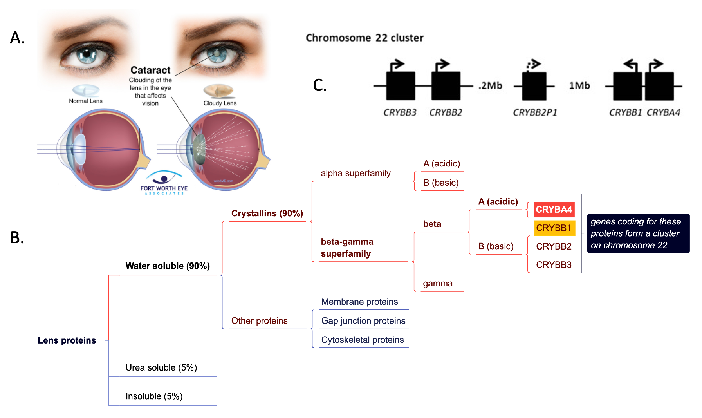


### 2-2 Learning more about the _CRYBA4_ gene and its variants

Access the page for [_CRYBA4_](https://www.genecards.org/cgi-bin/carddisp.pl?gene=CRYBA4#) at [GeneCards](https://www.genecards.org/), a comprehensive, integrative database for all annotated and predicted human genes. Read through the page and in particular the following sections:

- [Summaries](https://www.genecards.org/cgi-bin/carddisp.pl?gene=CRYBA4) for _CRYBA4_ gene. While at this section click on the OMIM link at the bottom. That will take you to the gene page in the [OMIM](https://www.omim.org/) (Online Mendelian Inheritance in Man) database, a compendium of human genes and genetic phenotypes.

- [Disorders](https://www.genecards.org/cgi-bin/carddisp.pl?gene=CRYBA4#diseases) associated with the _CRYBA4_ gene. While at this section click on the [_Cataract 23, Multiple Types_](https://www.malacards.org/card/cataract_23_multiple_types) link. It will take you to the disease page in the [MalaCards](https://www.malacards.org/), the human disease database.

- [Variants](https://www.genecards.org/cgi-bin/carddisp.pl?gene=CRYBA4#snp) for the _CRYBA4_ gene. Five known variants will be displayed by default. Click on the ```See all``` link at the right of the Filter box to display all reported variants for the gene.

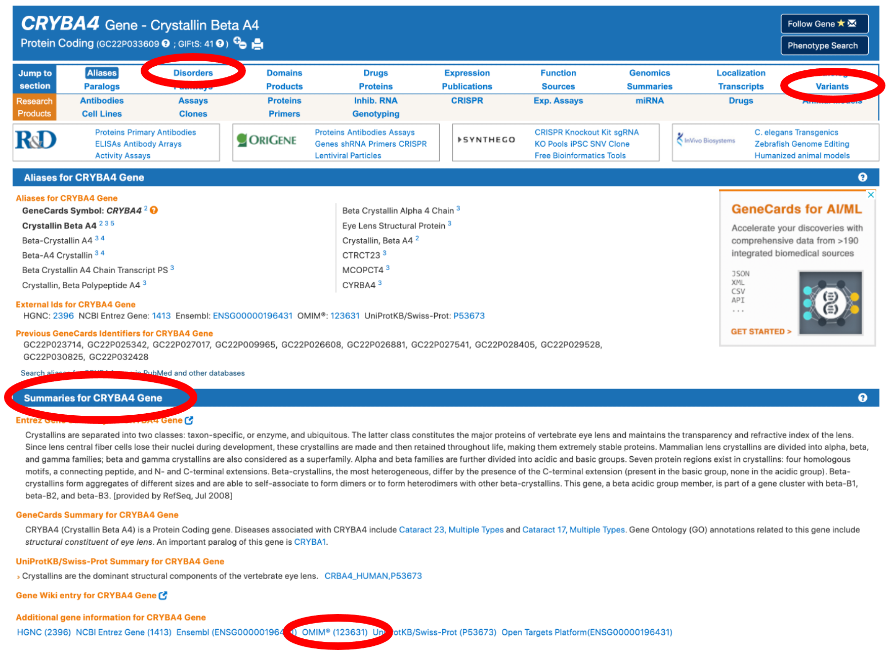


## 3  Identifying deleterious SNPs in the CRYBA4 gene using SnpEff
The Goal of this exercise is to familiarise yourself with a common annotation tool, and learn how to interpret the results.


for this exercise, we are going to annotate a ```.vcf```.
It was created by subsetting a larger (184GB) Database-style ```.vcf```, [the Single Nucleotide Polymorphism Database (dbSNP)](https://www.ncbi.nlm.nih.gov/books/NBK21088/), which you can [download from the NCBI ftp-server](https://ftp.ncbi.nlm.nih.gov/snp/latest_release/VCF/).
The file we are working with is much smaller and contains variants from a small subsection of the human chromosome 22.

For annotating these variants, we will be using [SnpEff](http://pcingola.github.io/SnpEff/) by [Cingolani et al (2012)](http://pcingola.github.io/SnpEff/adds/SnpEff_paper.pdf).
We will be working on Rackham for this, where SnpEff is installed as a module.

- log into rackham, start an interactive session with the reservation code ```reservation code```
- load the modules ```bioinfo-tools``` and ```snpEff/4.3t```
- copy the file ```/proj/g2020004/private/computer_practicals/GWAS06/20220425_chr22_targetregion.recode_diff_chrname.vcf``` to your working directory.


SnpEff works by comparing the positions of these SNPs against a database of genes, ORFs and other genome annotations to estimate the function and impact of individual SNPs.
 Many database annotations  e.g. for humans and model organisms are built into SnpEff, so we do not have to [generate them ourselves](http://pcingola.github.io/SnpEff/se_buildingdb/), though it is possible to do so from a ```.gff``` file.
You can have a look at the list of possible annotations using ```snpEff databases```. Be warned, its a long list!

It is important however, to match the reference genome your ```.vcf``` was based on, to a database based on the same reference. This information is stored in the ```.vcf``` file.
- Can you tell which reference our ```.vcf```file was built on? If you are unsure where to look, remember the [VCFv4.2 fileformat specifications](https://samtools.github.io/hts-specs/VCFv4.2.pdf).

We will be using the ```eff ``` command within snpEff to annotate our ```.vcf```-file and generate a ```.html``` report:

```bash
snpEff eff GRCh38.86 file.vcf  > file.ann.vcf
```

this will take a minute or two.
- have a look at the summary file using ```firefox```. If you do not have X11 forwarding enabled, or lack a X11 backend on your computer, you'll have to download the file.
  - how many of the SNPs are in the exonic regions?
  - how many variants result in a new stop-codon?
  - what is the Ts/Tv ratio?
  - why are the plots for the quality histogram and allele-frequency empty?
  - what is the most common amino-acid change?
  - how many times was the **GAG** codon mutated to **AAG** ?
  - how many times was the **TTG** codon mutated to **GTG**?
  - which of these two point mutations will likely have a larger impact on the protein structure? [hint](https://upload.wikimedia.org/wikipedia/commons/thumb/a/a9/Amino_Acids.svg/831px-Amino_Acids.svg.png)


Annotations for each individual variant will be stored in the newly created ```.vcf``` file.

- With that in mind, have a look at the ```.vcf``` file.
  - Can you find the annotation fields?
  - What is the prediction for variants  ```rs1459497417``` , ```rs1194205126```, ```rs74315486``` and ``` rs758790937 ``` ?
  - is this in line with the predictions from Wang et al? Refer to Table 1 in the paper.

For the subsequent analysis, we are only interested in the variants that have a "HIGH" or "MODERATE" predicted effect.

- extract these variants and put them in separate files. this will help us later when investigating these variants in the UCSC genome browser.
```bash
grep "#" 20220425_chr22_targetregion.recode_diff_chrname.ann.vcf > annot_mod.vcf && grep "MODERATE" 20220425_chr22_targetregion.recode_diff_chrname.ann.vcf >> annot_mod.vcf
grep "#" 20220425_chr22_targetregion.recode_diff_chrname.ann.vcf > annot_high.vcf && grep "HIGH" 20220425_chr22_targetregion.recode_diff_chrname.ann.vcf >> annot_high.vcf
```


## 4 Visualizing the gene and its annotated variants using the UCSC Genome Browser

### 4-1 Overview of the UCSC Genome Browser

[UCSC Genome Browser](https://genome-euro.ucsc.edu/index.html)

#### _What does the Genome Browser provide?_

As we focus our research on the genome sequence data, displaying billions of letters of genomic DNA is not effective. As an alternative, the Genome Browser provides a rapid and reliable approach for visualizing information at any scale. ```Tracks``` in the Genome Browser align all selected relevant information at one location, which makes it possible to explore and integrate multiple layers of information.


#### Reset to the default setting:  
For those whose who haven't used the genome browser before, you may reset to the default setting.

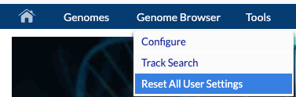  

#### Select species and assembly
Enter the selection page by clicking the “Genome Browser” option under the “Our tools” column.

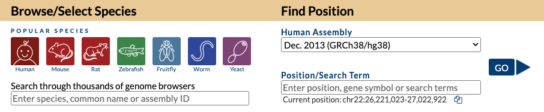  

On this page, you may select species from the ```Popular Species``` option, using the search field or the species tree. Importantly, on the right, you need to select the assembly version. That has to match the assembly version you used in SnpEff! Also, you need to supply the chromosome and start and end positions for the region that you want to visualize or an identifier for a gene, SNP, etc.

#### Browser interface

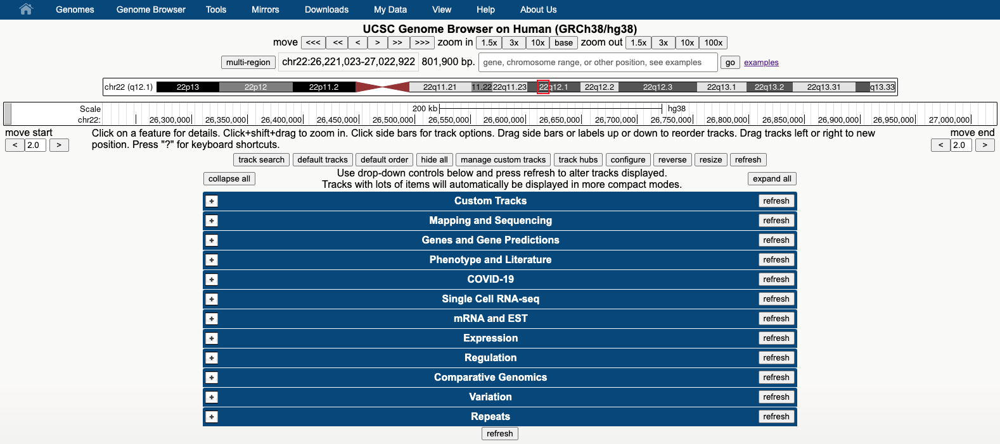  

When the genomic region you entered on the start page is visualized, multiple layers of information will be displayed as tracks. The tracks are grouped based on the type of information they provide. Click the button ```collapse all``` to display the different groups of tracks as in the figure above. Then explore them one by one by clicking on the ```+``` sign. Each group contains tracks from different sources. To learn more about a track, click on the track name and read the description. To learn more about the features displayed in the images (_e.g._ a gene) click on it to get detailed information about it.


#### Track display modes

You decide which tracks to display and how to display them. Each time you select or deselect a track, or you change the way it is displayed you need to click on ```refresh```.

A track can be hidden or it could be displayed with different degrees of detail. Try all these options yourself and notice the differences. A good track to experiment this on is the GENCODE V39 track under ```Genes and Gene Predictions``` which, according to its description (click on the track name to read it), shows high-quality manual annotations merged with evidence-based automated annotations across the entire human genome generated by the GENCODE project.


These are the track visualization options:

  

- Try all these options yourself and see what’s the difference.

**Hide**  
The track is not displayed at all. To hide all tracks, click the hide all button under all tracks.


**Dense**  
This option displays all features in one line and is useful for reducing space when you don’t need individual line item details or just need an overview of annotations.


**Full**  
This option displayed each feature on a separate line.
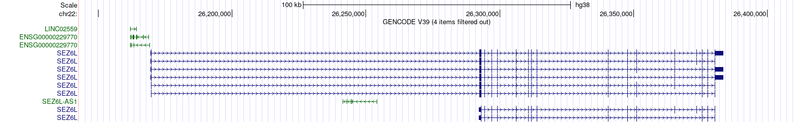


**Squish**  
This option is displaying each annotation feature separately but at 50% height of the full mode. Several features may be drawn in one line and they are unlabeled.


**Pack**  
Each annotation features displayed separately with label, but not necessarily on a separate line.

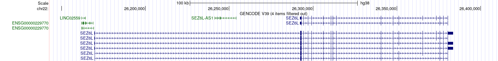


#### Highlighting a region
To highlight a selected region or an element (for example a SNP) you need to hold Alt+drag (Windows) or option+drag (Mac).  Highlights could be very helpful if you want to explore the larger context in which your region or element of interest resides (for example after you zoom out to visualize the larger genomic context).


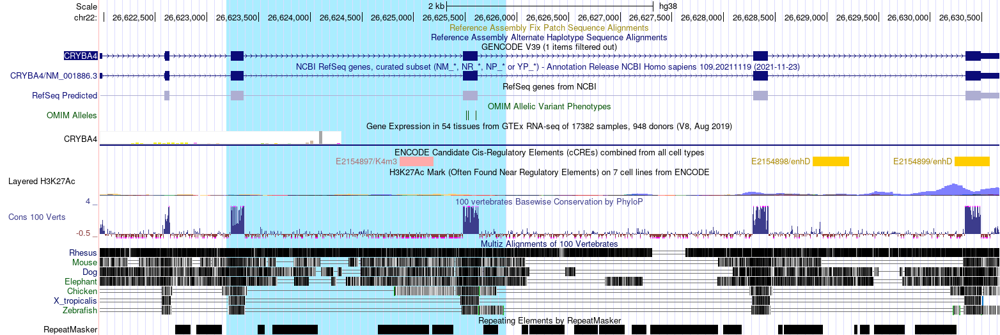  
Right-clicking in the track browser, you may zoom in to the highlighted region or to remove the highlight.  

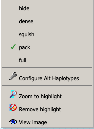


#### Further Navigation Options
In addition to specifying the chromosome and the start and end positions in the search box, you could navigate to the genomic location of interest by using gene identifiers (e.g. the gene symbol) or SNP rs identifiers.

- **By gene name** - in the search box at the top in which you see “gene, chromosome range or other position” type in  CRYBA4 and click “go”.

- **By gene name and the amino acid number** - you may navigate to the selected amino acid in a protein by specifying its number in the protein sequence. For example, type in CRYBA4 p22 and the browser will display the nucleotides coding for the 22nd amino acid of the protein.

- **By SNP identifier** - an “rs” number is also accepted in the search box (e.g. rs74315486)

#### Save as a png format image
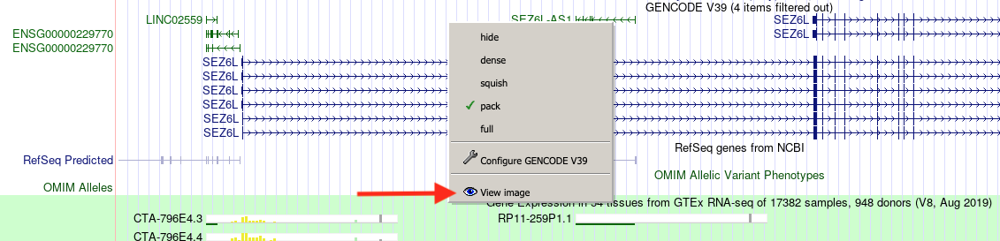  

Right-click at any place in the track viewer and select the “View Image” option from the pop-up menu. This will open a new tab in your browser showing the figure that you could download in png format; right click on the image and choose “Save image as”. Depending on your browser settings you may need to allow pop-ups from the UCSC in order for the image to be opened in a new tab.

### 4-2 Exploring the CRYBA4 locus in the UCSC Genome Browser

- Type the gene symbol **CRYBA4** in the search box at the top and click ```go```. Turn on all the default tracks.

	- where is the gene localized?
	- what other genes are nearby? Do they share any gene regions? Pay attention to where the arrow heads displayed throughout the intronic regions point to. If they point to the right, the gene is on the plus strand of the DNA, if they point to the left the gene is on the minus strand of the DNA.

- In the track listing, go down to the ```Comparative Genomics``` section, and click on the ```Conservation``` track link.
	- what does this track display?
	- inspect the Cons 100 Vert plots and notice how the degree of conservation varies across gene regions. What gene regions are most conserved?

Two important tracks displaying regulatory elements are included in the ```Regulation``` track group.

- click on the ```ENCODE cCRE``` link in the Regulation track section. What information does this provide?
- click on the ```ORegAnno``` link in the Regulation track section to learn more about this track. Turn it on and set it to _pack_.

- The Genome Browser also provides information on gene expression via the tracks in the ```Expression``` group. Turn on the gene expression track ```GTEx Gene V8``` and set it to _pack_. Click on the track name link to learn more about what data is included and how it was generated.

- Click on the GTEx Gene V8 bar plots corresponding to the _CRYBA4_ and _CRYBB1_ genes.

	- in what tissue is each gene most abundant?
	- what do you notice when you compare the expression plots for the two genes? It would be easier to download the two images and inspect them side by side.


### 4-3 Visualizing the SnpEff-annotated variants as a custom track in the UCSC Genome Browser

#### Custom tracks
One very powerful feature of the Genome Browser is its ability to upload data supplied by the user and display it as a custom track alongside all other tracks in its database. In the previous section, you generated the ```annot_high.vcf``` and ```annot_mod.vcf``` files. We are going to upload and visualize the SNPs in these files as custom tracks in the genome browser.


#### BED format
In order for the browser to map the user-supplied data to its internal data, it has to be uploaded in a specific format called BED (browser extensible data) format in which the data lines to be displayed in the custom track are defined. In this case, each SNP will constitute a line in the BED file.

The BED file is a space- or tab-delimited text file that contains a number of required and optional fields.


The first three required BED fields are:
- **chrom**: The name of the chromosome (e.g. chr3, chrY) or scaffold.
- **chromStart**: The starting position of the feature in the chromosome or scaffold.
- **chromEnd**: The ending position of the feature in the chromosome or scaffold.

The 9 additional optional BED fields are:
- **name**: The name of the BED line
- **score**: A score between 0 and 1000. (higher number = darker gray)
- **strand**: Either “.” (no strand), “+”, or “-”
- **thickStart**: The starting position at which the feature is drawn thickly
- **thickEnd**: The ending position at which the feature is drawn thickly
- **itemRgb**: An RGB value of the form R,G,B (e.g. 255,0,0)
- **blockCount**: The number of blocks (exons) in the BED line
- **blockSizes**: A comma-separated list of the block sizes.
- **blockStarts**: A comma-separated list of block starts.

#### Generating the BED format files
A BED file may be generated in several ways (in bash, R, python, Excel etc.). The following bash script is one such solution. The content of the ```annot_high.bed``` file will be displayed in red and the one of the ```annot_mod.bed``` file in green.

```bash
grep -v "#" annot_high.vcf | awk '{print $1, $2, $2, $3}' | paste -d - > annot_high.bed
sed -i '1s/^/track color=255,0,0 visiblity=full name='ANNOT_HIGH' description='annot_high' visibility=3\n/' annot_high.bed
sed -i '1s/^/browser position chr22:26602982-26635663\n/' annot_high.bed

```

Below are the first 12 lines of the ```annot_high.bed``` file.

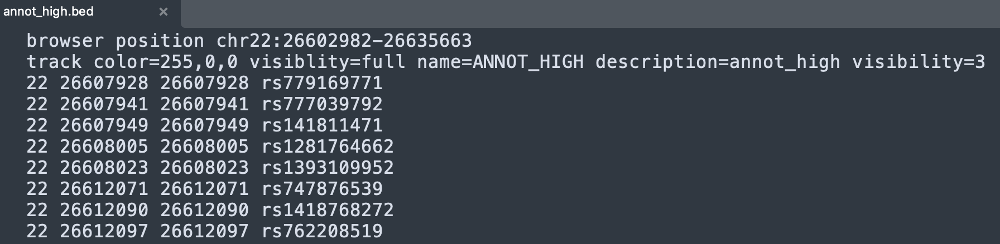


Similarly, we can prepare the ```annot_mod.bed``` file with the script below.

```bash
grep -v "#" annot_mod.vcf | awk '{print $1, $2, $2, $3}' | paste -d - > annot_mod.bed
sed -i '1s/^/track color=0,128,0 visiblity=full name='ANNOT_MOD' description='annot_mod' visibility=3\n/' annot_mod.bed
sed -i '1s/^/browser position chr22:26602982-26635663\n/' annot_mod.bed

```


#### Uploading the BED format files as custom tracks
Select the ```custom tracks``` option under the ```my data``` button.  
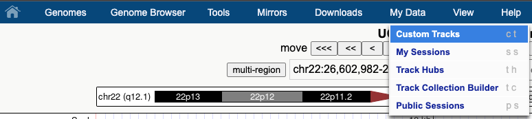

Click on```Choose file``` to upload the ```annot_high.bed``` file from your computer and submit it. Click on ```add custom tracks``` on the next page and repeat the process to upload the ```annot_mod.bed``` file.

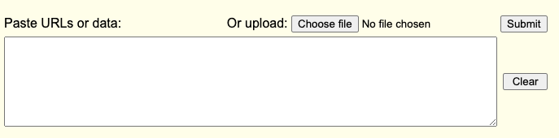

he next ```Manage Custom Tracks``` page will list the name of the files, the description, the number of items in the file and the position on the chromosome. This page also allows you to delete a custom track when it is no longer needed.

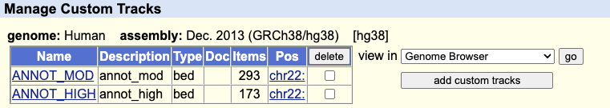

Click ```go``` at the right of ```view in Genome Browser``` to display the two tracks in the browser, in different colors if you created your BED files correctly.
You will now have a new track group ```Custom tracks``` at the top. Each of the bed files appears as a track and you can customize its display. Turn them to ```dense``` for now.

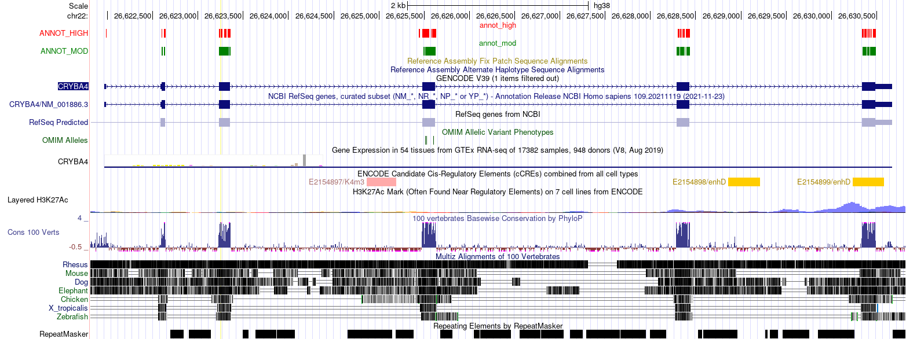

#### _Exploring the variants_

**Make sure that the following tracks are turned on**:

- in the ```Conservation``` group, set ```Conservation``` to _full_
- in the ```Regulation``` group, set ```ENCODE cCREs``` and ```ORegAnno``` to _dense_
- go to the ```Phenotype and Literature``` group. Set the ```OMIM Alleles``` and ```ClinVar Variants``` to _pack_.
- to begin with, you may need to turn your custom tracks to _dense_, but later on you will need to set them to _pack_ or _full_.

Click on the link in the name of the ```OMIM Alleles``` and ```ClinVar Variants``` and read the description. In particular, familiarize yourself with the color coding and the meaning of the letter symbols used in the ClinVar track.

As you notice, the SnpEff annotated variants occur in exonic regions. Using the highlight/zoom function described above, zoom into 2 exonic regions of your choice. Turn the custom tracks to pack or full. Using the highlight function, select 3 SnpEff variants that are most likely to be pathogenic and would constitute good candidates for follow-up experiments. Make your selection based on the information in the other tracks too.

- which SNPs would you prioritize for follow-up experiments?
- what criteria did you use to select them?
- include a picture highlighting your selected SNPs in your report


## 5 Identifying deleterious SNPs in the** _CRYBA4_ gene using the ENSEMBL Variant Effect Predictor (VEP) -

### 5-1 Overview of the ENSEMBL VEP

#### _What does VEP provide?_

VEP is a software suite that is part of the [ENSEMBL project](http://www.ensembl.org/info/docs/tools/index.html). It performs the analysis and annotation of many types of genomic variants with the goal of predicting their functional consequences. VEP could be run via its online interface or from the command line. In this exercise we will use the online interface.

### 5-2 Using VEP to annotate the SnpEff modifiers annotated as having HIGH impact

Go to the [VEP page](http://www.ensembl.org/info/docs/tools/vep/index.html) and from the Web interface section click on ```Launch Ve!P```.

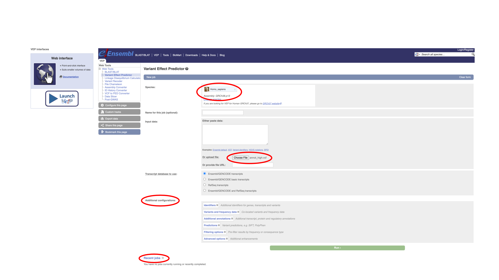

On the ```New job``` page, note the followings:

- the default species and assembly is _Homo sapiens GRCh38.p13,_ which is what you used for SnpEff, so you do not need to change it.
- the input to VEP could be supplied in [different data formats](https://www.ensembl.org/info/docs/tools/vep/vep_formats.html) such as VEP or VCF format etc. The input could be pasted in the Input box (in the case of a handful of variants) or uploaded as a file for larger datasets. For this exercise you will upload the ```annot_high.vcf``` file that you prepared in Part 2.
- there are several additional configurations that you could choose from. Explore some of them by expanding them, but, for now proceed with the default options. You could turn on/off the display for some of these options from the Results page.
- the link at the bottom of the page listing the ```Recent jobs``` that you submitted; this list could come in handy later.

Click on the green ```Run``` button. Your job will be placed in queue and run; this will take a few minutes depending on how busy the server is. When the run is completed, click on the ```View results``` link.


#### _Exploring and navigating the VEP results page_

Start exploring the VEP results page by expanding the ```Job details``` section. These were the parameters you used in your search. Note the ```Command line equivalent``` at the bottom; this is how you would run VEP from the command line to produce the same results.

The ```Summary statistics``` section provides a very informative breakdown of the results and also pie charts describing the proportion of the different categories of variants with respect to their predicted consequences (in general) and predicted coding consequences (in particular).

⁃ which were the top two most abundant types of general and coding consequences found?

⁃ which types of consequences in the two categories do you think would have the most dramatic effect?

To display all results in one page rather than having them broken down in several pages (which will interfere with sorting), click on ```All``` in the Navigation per variant panel.

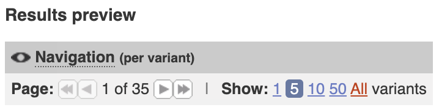

Note the following:

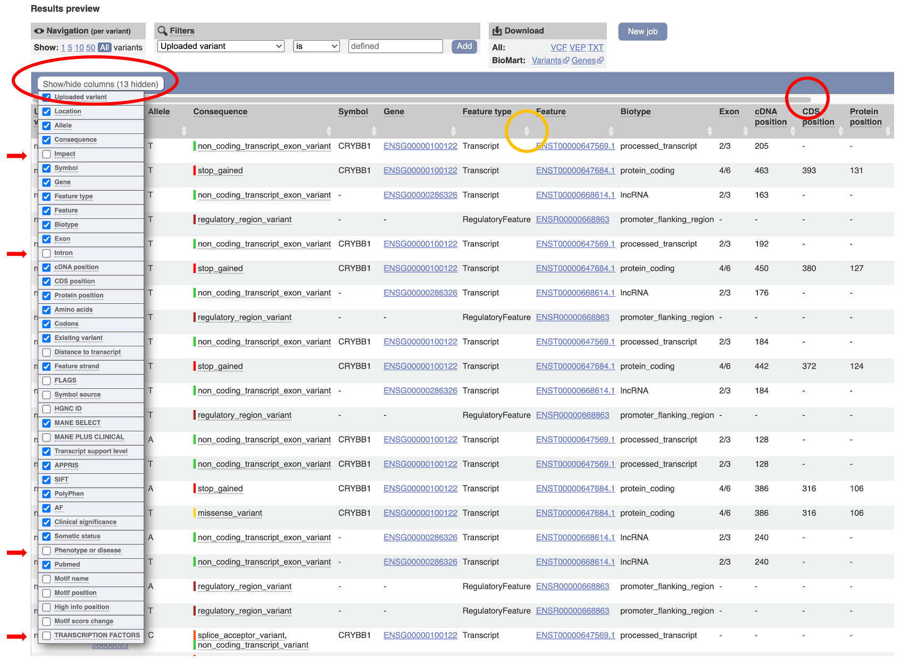

- the ```Show/hide columns``` button controls the information displayed. Click on it and select a few additional very informative columns such as _Impact_, _Intron_, _Phenotype or disease_ and _Transcription factors_. To simplify the display, unselect columns such as MANE SELECT and APPRIS. Each time you want to focus on a particular set of columns you could deselect the others to eliminate them from the display using this button.
- above the column headings you will find a gray scrolling bar (red circle); drag it to the right to see the rest of the columns.
- at the right of all column headers (mouse over them to see a brief description) there are two triangles pointing up and down (orange circle); by clicking them you could sort the results page by the values in that column in ascending or descending order.

#### Downloading the results

You could download the results in different formats and analyze them locally in Excel or R or use them as input for other bioinformatics tools. For this, follow the appropriate link in the Download section.

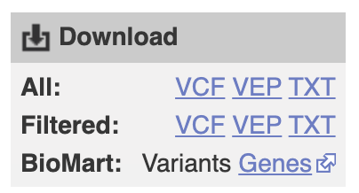

Please, note, that if you choose the Excel format, when you open the file, in the third step of the import dialog you will need to specify the Data Format for the EXON and INTRON fields as Text, otherwise Excel will display the values in these columns as dates [2/3 will become Mar-2 or Feb-3 depending on your date settings].

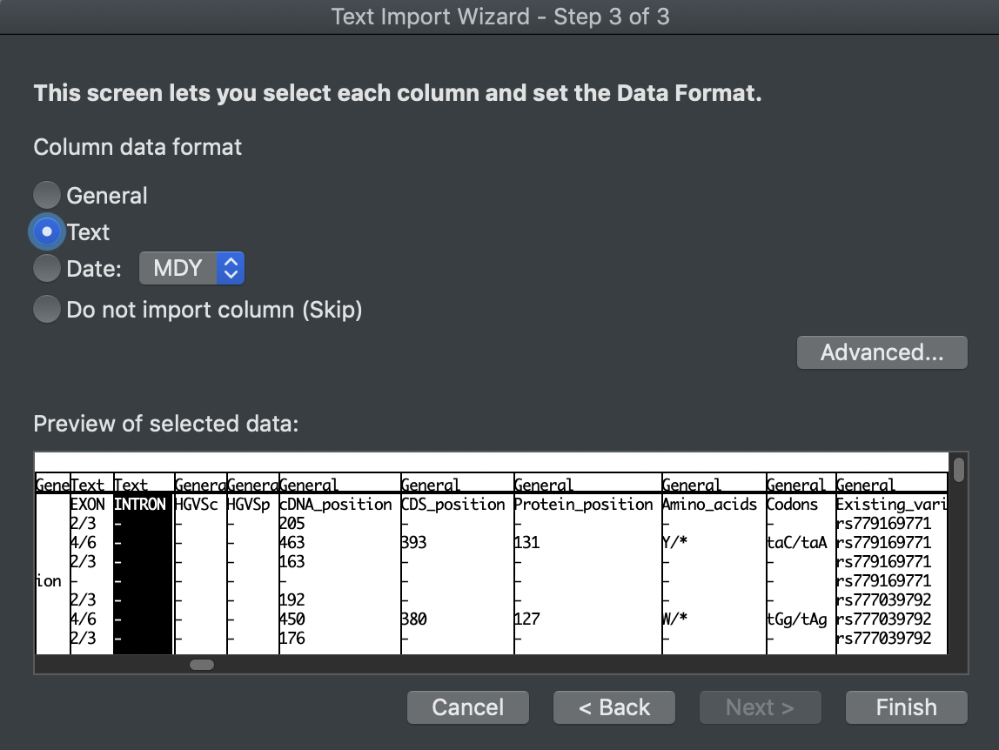

### 5-3 Exploring the agreement between the annotation obtained with different tools

As this point, the VEP results page displays annotations for the variants you uploaded produced with four different tools: the implicit SnpEff annotation (since you uploaded only the variants predicted to have HIGH impact), the VEP annotation (listed in the Impact column) and scores from two other annotation programs — [SIFT](https://sift.bii.a-star.edu.sg/www/SIFT_help.html)] and [PolyPhen](http://genetics.bwh.harvard.edu/pph/#:~:text=PolyPhen%20(%3DPolymorphism%20Phenotyping)%20is,straightforward%20physical%20and%20comparative%20considerations).

To explore how well these tools agree in their annotations let's sort the results page by the PolyPhen scores by clicking on the arrow pointing up at the right of the column name. Mouse-over the scores in the differently colored boxes to understand the color legend.

- what do you notice regarding the number of variants that have a SIFT and PolyPhen score compared to the total number of variants annotated by VEP?
- if you look at the SIFT/PolyPhen scores and the VEP annotation displayed in the Impact column, overall, is there good agreement between the three? What about between all four tools, keeping in mind that all the variants on this page were annotated as HIGH by SnpEff?

This illustrates the fact that in order to select the strongest candidates for further analyses it is useful to corroborate the annotation obtained with multiple tools.

### 5-4 Exploring the annotation of the novel variants

Have a look again at the summary statistics reported by VEP.

- how many of the variants in this set were novel and how many were known?

Let's take a closer look at the novel variants, To simplify the display, let's filter out all the known variants. For this we can use the filter box with the following parameters:

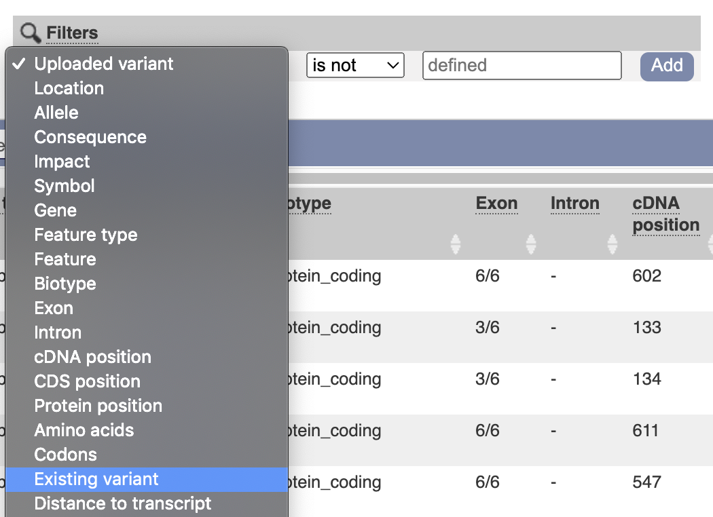

Since, we are interested in those variants for which the ```Existing variant``` field is not defined (contains a dash) we can specify this in the Filter box by choosing ```Existing variant``` in the first field and ```is not``` in the second field and then click ```Add```. The page now displays only the novel variants and their annotation.

_Filters provide a powerful way to explore further the results. You could add additional filters pertaining to other fields in the same manner. To go back to the original display just delete all filters. You could add filters to an already filtered result set. In the unlikely event that the results page crashes if a combination of filters is not supported, just follow the ```New Job``` link at the bottom of the page and from there follow the ```Recent jobs``` link. Your jobs are saved and you could restore their results page by clicking ```View results```._

The filtered list of novel variants has many more rows than the number of novel variants reported in the statistics section. Why is that? Hint: sort the results by Uploaded variant.

Sort the list again by PolyPhen score. Notice that only a handful of novel variants were annotated by Sift and PolyPhen.

Sort the list by column Impact (the VEP annotation)

- how many HIGH impact novel variants did VEP found for _CRYBA4_?
- these were also variants that SnpEff annotated as having a HIGH impact. If you were to prioritize them for further investigations, which top three candidates would you choose and why?
