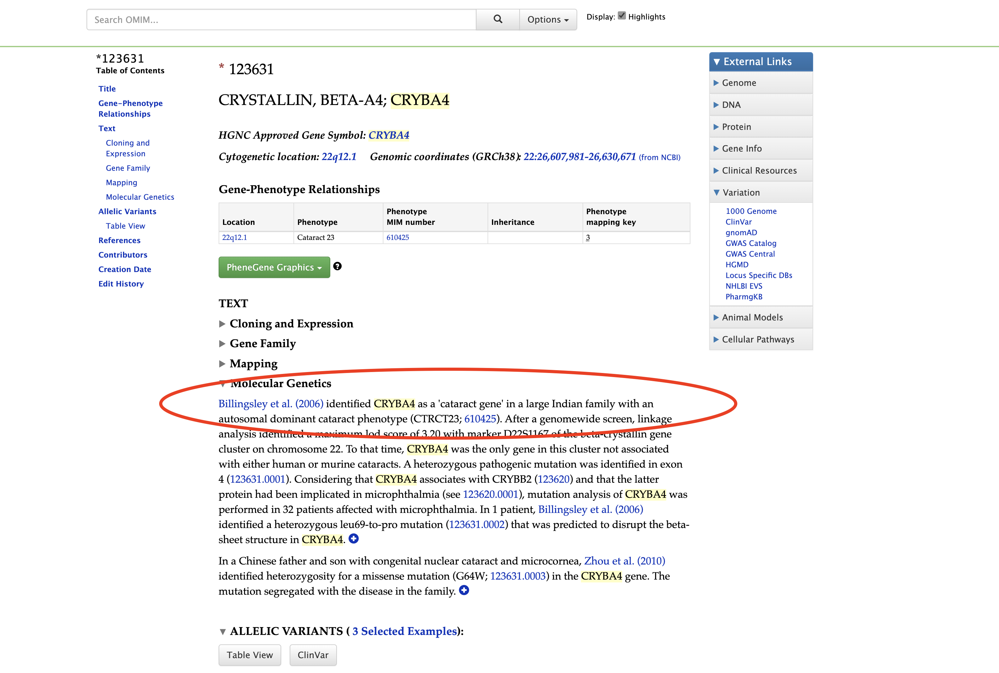

# UNDER CONSTRUCTION


# Table of Contents
<!-- TOC depthFrom:1 depthTo:6 withLinks:1 updateOnSave:0 orderedList:0 -->

- [UNDER CONSTRUCTION](#under-construction)
- [Table of Contents](#table-of-contents)
- [0: Introduction & Overview](#0-introduction-overview)
	- [0.1: Material](#01-material)
	- [0.2: Overview and learning goals](#02-overview-and-learning-goals)
	- [0.3: Requirements for completion.](#03-requirements-for-completion)
	- [0.4: The larger context](#04-the-larger-context)
			- [Scope and limitations of the bioinformatics approach](#scope-and-limitations-of-the-bioinformatics-approach)
	- [1: Choosing a gene](#1-choosing-a-gene)
			- [1.1: is the gene relevant for the disease?](#11-is-the-gene-relevant-for-the-disease)
			- [1.2: Where and when is the gene expressed?](#12-where-and-when-is-the-gene-expressed)
			- [1.3: Does the loss of function animal model have a phenotype?](#13-does-the-loss-of-function-animal-model-have-a-phenotype)
			- [1.4: is the three-dimensional structure resolved?](#14-is-the-three-dimensional-structure-resolved)
			- [1.5: Focussing on nsSNP occuring in a gene of interest](#15-focussing-on-nssnp-occuring-in-a-gene-of-interest)
	- [2: Evaluating the potential effect of a nSNP](#2-evaluating-the-potential-effect-of-a-nsnp)
		- [2.1: Predicting a deleterious effect](#21-predicting-a-deleterious-effect)
		- [2.2: Identifying categories of interest](#22-identifying-categories-of-interest)
		- [2.3:  Evaluate the impact of the substitution on the 3D structure of a protein](#23-evaluate-the-impact-of-the-substitution-on-the-3d-structure-of-a-protein)
		- [2.4: Integrative evaluation](#24-integrative-evaluation)
		- [2.5: Selecting the final candidate SNP set](#25-selecting-the-final-candidate-snp-set)
	- [3: Designing follow-up investigations](#3-designing-follow-up-investigations)
		- [EXAMPLE code section](#example-code-section)

<!-- /TOC -->


# 0: Introduction & Overview

## 0.1: Material
[Wang et al 2020](./wang_etal_2020.pdf)  

Dataset:
```bash
/path/to/directory/on/uppmax/that/holds/the/file
```


## 0.2: Overview and learning goals
This Afternoon's Practical is structured into three parts:

[Part 1](#1-choosing-a-gene),  Which focusses on choosing a gene to investigate. Often, regions of the genome implicated in a condition are large, and tagging markers (e.g. from a GWAS, QTL-scan or Linkage analysis) may not have the resolution to narrow it to a single gene.
Here, Knowledge of the underlying biology and auxillary data from online-databases can help to pick a likely candidate.
In this section you will learn:

 - how to A
 - how to B


[Part 2](#2-identifying-a-set-of-candidate-snps),
 Lorem ipsum dolor sit amet, consectetur adipiscing elit, sed do eiusmod tempor incididunt ut labore et dolore magna aliqua. Ut enim ad minim veniam, quis nostrud exercitation ullamco laboris nisi ut aliquip ex ea commodo consequat. Duis aute irure dolor in reprehenderit in voluptate velit esse cillum dolore eu fugiat nulla pariatur. Excepteur sint

 - how to C
 - how to D

[Part 3](#part-3-designing-follow-up-investigations)
 Lorem ipsum dolor sit amet, consectetur adipiscing elit, sed do eiusmod tempor incididunt ut labore et dolore magna aliqua. Ut enim ad minim veniam, quis nostrud exercitation ullamco laboris nisi ut aliquip ex ea commodo consequat. Duis aute irure dolor in reprehenderit in voluptate velit esse cillum dolore eu fugiat nulla pariatur. Excepteur sint

 - how to E
 - how to F

## 0.3: Requirements for completion.
 - A
 - B
 - C

## 0.4: The larger context
#### Scope and limitations of the bioinformatics approach
Lorem ipsum dolor sit amet, consectetur adipiscing elit, sed do eiusmod tempor incididunt ut labore et dolore magna aliqua. Ut enim ad minim veniam, quis nostrud exercitation ullamco laboris nisi ut aliquip ex ea commodo consequat. Duis aute irure dolor in reprehenderit in voluptate velit esse cillum dolore eu fugiat nulla pariatur. Excepteur sint occaecat cupidatat non proident, sunt in culpa qui officia deserunt mollit anim id est laborum.


## 1: Choosing a gene
Lorem ipsum dolor sit amet, consectetur adipiscing elit, sed do eiusmod tempor incididunt ut labore et dolore magna aliqua. Ut enim ad minim veniam, quis nostrud exercitation ullamco laboris nisi ut aliquip ex ea commodo consequat.
#### 1.1: is the gene relevant for the disease?
Lorem ipsum dolor sit amet, consectetur adipiscing elit, sed do eiusmod tempor incididunt ut labore et dolore magna aliqua.  
- [OMIM](https://www.omim.org/entry/123631?search=CRYBA4&highlight=cryba4)  


<details>

<summary>hint</summary>

<p>


     


</p>

</details>


<br>
<br>

#### 1.2: Where and when is the gene expressed?
- general and dedicated databases
- developmenatal databases

#### 1.3: Does the loss of function animal model have a phenotype?
- mouse MGI
#### 1.4: is the three-dimensional structure resolved?
- PDB

#### 1.5: Focussing on nsSNP occuring in a gene of interest
- diagram with the possible sources of variation
- why nsSNPs?
- Retrieving information from SNP databases


- dbSNP
- ClinVar
- DisGeNet

## 2: Evaluating the potential effect of a nSNP
Lorem ipsum dolor sit amet, consectetur adipiscing elit, sed do eiusmod tempor incididunt ut labore et dolore magna aliqua. Ut enim ad minim veniam, quis nostrud exercitation ullamco laboris nisi ut aliquip ex ea commodo consequat. Duis aute irure dolor in reprehenderit in voluptate velit esse cillum dolore eu fugiat nulla pariatur. Excepteur sint occaecat cupidatat non proident, sunt in culpa qui officia deserunt mollit anim id est laborum.
[DATABASE_A](https://www.youtube.com/watch?v=dQw4w9WgXcQ)
[DATABASE_B](https://www.youtube.com/watch?v=UWRyj5cHIQA)


### 2.1: Predicting a deleterious effect
- SnpEff

### 2.2: Identifying categories of interest

- Conserved SNPs

	- UCSC Browser

- Regulatory SNPs

	- ENCODE

- SNPs in protein domains

	- PFAM

### 2.3:  Evaluate the impact of the substitution on the 3D structure of a protein

- PDB

### 2.4: Integrative evaluation

- Ensembl Variant Effect Predictor

### 2.5: Selecting the final candidate SNP set


## 3: Designing follow-up investigations


### EXAMPLE code section
```R
pow.calc <- function(n, rsquare, maf, beta){
  ncp <- n*rsquare*2*maf*(1-maf)*beta*beta
  return(ncp)
}
```



