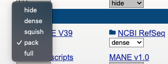
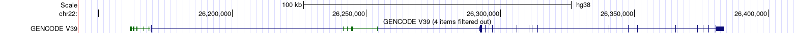

theme: jekyll-theme-slate
markdown: CommonMarkGhPages

# UNDER CONSTRUCTION


# 0: Introduction & Overview

## 0.1: Material
[Wang et al 2020](./wang_etal_2020.pdf)  

Dataset:
```bash
/path/to/directory/on/uppmax/that/holds/the/file
```


## 0.2: Overview and learning goals
This Afternoon's Practical is structured into three parts:

[Part 1](#1-choosing-a-gene),  Which focusses on choosing a gene to investigate. Often, regions of the genome implicated in a condition are large, and tagging markers (e.g. from a GWAS, QTL-scan or Linkage analysis) may not have the resolution to narrow it to a single gene.
Here, Knowledge of the underlying biology and auxillary data from online-databases can help to pick a likely candidate.
In this section you will learn:

 - how to A
 - how to B


[Part 2](#2-identifying-a-set-of-candidate-snps),
 Lorem ipsum dolor sit amet, consectetur adipiscing elit, sed do eiusmod tempor incididunt ut labore et dolore magna aliqua. Ut enim ad minim veniam, quis nostrud exercitation ullamco laboris nisi ut aliquip ex ea commodo consequat. Duis aute irure dolor in reprehenderit in voluptate velit esse cillum dolore eu fugiat nulla pariatur. Excepteur sint

 - how to C
 - how to D

[Part 3](#part-3-designing-follow-up-investigations)
 Lorem ipsum dolor sit amet, consectetur adipiscing elit, sed do eiusmod tempor incididunt ut labore et dolore magna aliqua. Ut enim ad minim veniam, quis nostrud exercitation ullamco laboris nisi ut aliquip ex ea commodo consequat. Duis aute irure dolor in reprehenderit in voluptate velit esse cillum dolore eu fugiat nulla pariatur. Excepteur sint

 - how to E
 - how to F

## 0.3: Requirements for completion.
 - A
 - B
 - C


## 0.4: The larger context
#### Scope and limitations of the bioinformatics approach
Lorem ipsum dolor sit amet, consectetur adipiscing elit, sed do eiusmod tempor incididunt ut labore et dolore magna aliqua. Ut enim ad minim veniam, quis nostrud exercitation ullamco laboris nisi ut aliquip ex ea commodo consequat. Duis aute irure dolor in reprehenderit in voluptate velit esse cillum dolore eu fugiat nulla pariatur. Excepteur sint occaecat cupidatat non proident, sunt in culpa qui officia deserunt mollit anim id est laborum.

<details>
<summary>hint</summary>
<p>
     
</p>
</details>


## 1: Choosing a gene
Lorem ipsum dolor sit amet, consectetur adipiscing elit, sed do eiusmod tempor incididunt ut labore et dolore magna aliqua. Ut enim ad minim veniam, quis nostrud exercitation ullamco laboris nisi ut aliquip ex ea commodo consequat.
#### 1.1: is the gene relevant for the disease?
Lorem ipsum dolor sit amet, consectetur adipiscing elit, sed do eiusmod tempor incididunt ut labore et dolore magna aliqua.  
- [OMIM](https://www.omim.org/entry/123631?search=CRYBA4&highlight=cryba4)  


#### 1.2: Where and when is the gene expressed?
- general and dedicated databases
- developmenatal databases

#### 1.3: Does the loss of function animal model have a phenotype?
- mouse MGI
#### 1.4: is the three-dimensional structure resolved?
- PDB

#### 1.5: Focussing on nsSNP occuring in a gene of interest
- diagram with the possible sources of variation
- why nsSNPs?
- Retrieving information from SNP databases


- dbSNP
- ClinVar
- DisGeNet

## 2:  Identifying deleterious SNPs in the CRYBA4 gene using SnpEff
The Goal of this exercise is to familiarise yourself with a common annotation tool, and learn how to interpret the results.


for this exercise, we are going to annotate a ```.vcf```.
It was created by subsetting a larger (184GB) Database-style ```.vcf```, [the Single Nucleotide Polymorphism Database (dbSNP)](https://www.ncbi.nlm.nih.gov/books/NBK21088/), which you can [download from the NCBI ftp-server](https://ftp.ncbi.nlm.nih.gov/snp/latest_release/VCF/).
The file we are working with is much smaller and contains variants from a small subsection of the human chromosome 22.

For annotating these variants, we will be using [SnpEff](http://pcingola.github.io/SnpEff/) by [Cingolani et al (2012)](http://pcingola.github.io/SnpEff/adds/SnpEff_paper.pdf).
We will be working on Rackham for this, where SnpEff is installed as a module.

- log into rackham, start an interactive session with the reservation code ```reservation code```
- load the modules ```bioinfo-tools``` and ```snpEff/4.3t```
- copy the file ```/proj/g2020004/private/computer_practicals/GWAS06/20220425_chr22_targetregion.recode_diff_chrname.vcf``` to your working directory.


SnpEff works by comparing the positions of these SNPs against a database of genes, ORFs and other genome annotations to estimate the function and impact of individual SNPs.
Many databases e.g. for humans and model organisms (and an update mechanism) are built into snpEff, so we do not have to [make them ourselves](http://pcingola.github.io/SnpEff/se_buildingdb/), though it is possible to do so from a ```.gff``` file.
You can have a look at the list of databases using ```snpEff databases```. Be warned, its a long list!

It is important however, to match the reference genome your ```.vcf``` was based on, to a database based on the same reference. This information is stored in the ```.vcf``` file.
- Can you tell which reference our ```.vcf```file was built on? if you are unsure where to look, remember the [VCFv4.2 fileformat specifications](https://samtools.github.io/hts-specs/VCFv4.2.pdf).

we will be using the ```eff ``` command within snpEff to annotate our ```.vcf```-file and generate a ```.html``` report:

```bash
snpEff eff GRCh38.86 file.vcf  > file.ann.vcf
```

this will take a minute or two.
- have a look at the summary file using firefox. If you do not have X11 forwarding enabled, or lack a X11 backend on your computer, you'll have to download the file.
  - how many of the SNPs are in the exonic regions?
  - how many variants result in a new stop-codon?
  - what is the Ts/Tv ratio?
  - why are are the plot for the quality histogram and allele-frequency empty?
  - what is the most common amino-acid change?
  - how many times was the **GAG** codon mutated to **AAG** ?
  - how many times was the **TTG** codon mutated to **GTG**?
  - which of these two point mutations will likely have a larger impact on the protein structure? [hint](https://upload.wikimedia.org/wikipedia/commons/thumb/a/a9/Amino_Acids.svg/831px-Amino_Acids.svg.png)


Annotations for each individual variant will be stored in the newly created ```.vcf``` file.

- With that in mind, have a look at the ```.vcf``` file.
  - Can you find the annotation fields?
  - what is the prediction for variants  ```rs1459497417``` , ```rs1194205126```, ```rs74315486``` and ``` rs758790937 ``` ?
  - is this in line with the predictions from Wang et al?

for the subsequent analysis, we are only interested in the variants that have a "HIGH" or "MODERATE" predicted effect.

- extract these variants and put them in separate files. this will help us later when investigating these variants in the UCSC genome browser.
```bash
grep "#" 20220425_chr22_targetregion.recode_diff_chrname.ann.vcf > annot_mod.vcf && grep "MODERATE" 20220425_chr22_targetregion.recode_diff_chrname.ann.vcf >> annot_mod.vcf
grep "#" 20220425_chr22_targetregion.recode_diff_chrname.ann.vcf > annot_high.vcf && grep "HIGH" 20220425_chr22_targetregion.recode_diff_chrname.ann.vcf >> annot_high.vcf
```


## Part 3: The UCSC Genome Browser
The UCSC Genome Browser is a web-based tool for visualising genomic features. You can find it [here](https://genome-euro.ucsc.edu/index.html)

### What does the Genome Browser do?
As we focus our research on the genome sequence data, displaying billions of letters of genomic DNA is not effective. As an alternative, the genome browser provides a rapid and reliable approach for displaying information at any scale. “Tracks” in the genome browser align all selected relevant information in one location, which makes it easier for us to explore the hidden information.

##### Reset to the default setting:  
For those whose who haven't used the genome browser before, you may reset to the default setting.

  

##### Select species and assembly
Enter the selection page by clicking the “Genome Browser” option under the “Our tools” column.

  

On this page, you may select species (from popular species options, through the search bar, or the species tree), assembly versions, and the position.

##### Browser interface

  

##### Save as a png format image
  

You may now click the default tracks button to open some tracks. Right-click on any place in the track viewer and select the “View Image” option in the pop-up menu. This will bring you to a new tab in your browser showing a png format figure where you can download it.

##### Annotation track display modes

  
Try all these options yourself and see what’s the difference.

**Hide**  
The track is not displayed at all. To hide all tracks, click the hide all button under all tracks.


**Dense**  
This option displays all features in one line and is useful for reducing space when you don’t need individual line item details or just need an overview of annotations.



**Full**  
This option displayed each feature on a separate line.


**Squish**  
This option is displaying each annotation feature separately but at 50% height of the full mode. Several features may be drawn in one line and they are unlabeled.


**Pack**  
Each annotation features displayed separately with label, but not necessarily on a separate line.


#### Highlighting a region
To highlight selected region, hold Alt+drag (Windows) or option+drag (Mac).  

  
Right-clicking in the track browser, you may zoom in to the highlighted region or to remove the highlight.  


#### Navigation

##### By gene name
Simply type the gene name in the search box. Let’s start with the CRYBA4 gene and turn on all the default tracks. Where does this gene locate?
##### By gene name and the amino-acid number
You may navigate to the selected amino acid on the gene by its number. For example, type in CRYBA4 p22 will navigate to the 22nd amino acid of the CRYBA4 gene.
##### Reference SNP
The name of the reference SNP id is also accepted by the search box.
##### To get more information
Clicking on tracks and annotations in the browser will lead you to detailed information about them.

### Custom tracks
In the previous section, we generated ```annot_high.vcf``` and ```annot_mod.vcf``` files. Here we are going to upload this information to the genome browser.

#### BED format
BED (browser extensible data) format provides a flexible way to define the data lines that are displayed in the track.

The first three required BED fields are:
- **chrom**: The name of the chromosome (e.g. chr3, chrY) or scaffold.
- **chromStart**: The starting position of the feature in the chromosome or scaffold.
- **chromEnd**: The ending position of the feature in the chromosome or scaffold.

The 9 additional optional BED fields are:
- **name**: The name of the BED line
- **score**: A score between 0 and 1000. (higher number = darker gray)
- **strand**: Either “.” (no strand), “+”, or “-”
- **thickStart**: The starting position at which the feature is drawn thickly
- **thickEnd**: The ending position at which the feature is drawn thickly
- **itemRgb**: An RGB value of the form R,G,B (e.g. 255,0,0)
- **blockCount**: The number of blocks (exons) in the BED line
- **blockSizes**: A comma-separated list of the block sizes.
- **blockStarts**: A comma-separated list of block starts.

##### Generate BED format file yourself
_**NOTE**: You may do this is different ways (bash, R, python, excel etc.). The following bash scripts is my solution._

```bash
grep -v "#" annot_high.vcf | awk '{print $1, $2, $2, $3}' | paste -d - > annot_high.bed
sed -i '1s/^/track color=255,0,0 visiblity=full name='ANNOT_HIGH' description='annot_high' visibility=3\n/' annot_high.bed
sed -i '1s/^/browser position chr22:26602982-26635663\n/' annot_high.bed

```

##### Upload custom track information
Select the ```custom tracks``` option under the my data button.  


Choose the files from your folder and submit it. you may need to download them to your local machine first.


You should now have your file listed in the table showing it’s name, description, number of items, and position.


Eventually, you can find your information in the browser (in different color if you created your BED files correctly).


### 2.3:  Evaluate the impact of the substitution on the 3D structure of a protein

- PDB

### 2.4: Integrative evaluation

- Ensembl Variant Effect Predictor

### 2.5: Selecting the final candidate SNP set


## 3: Designing follow-up investigations


### EXAMPLE code section
```R
pow.calc <- function(n, rsquare, maf, beta){
  ncp <- n*rsquare*2*maf*(1-maf)*beta*beta
  return(ncp)
}
```



